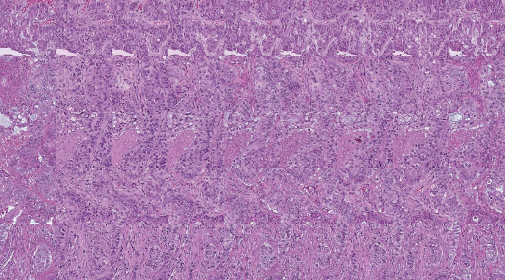
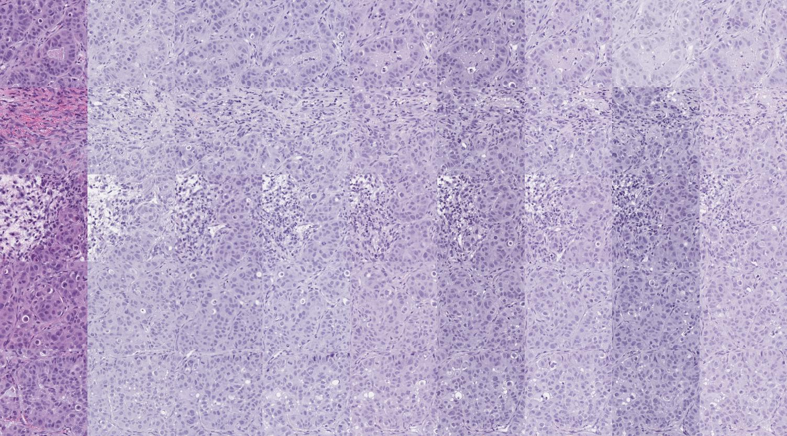
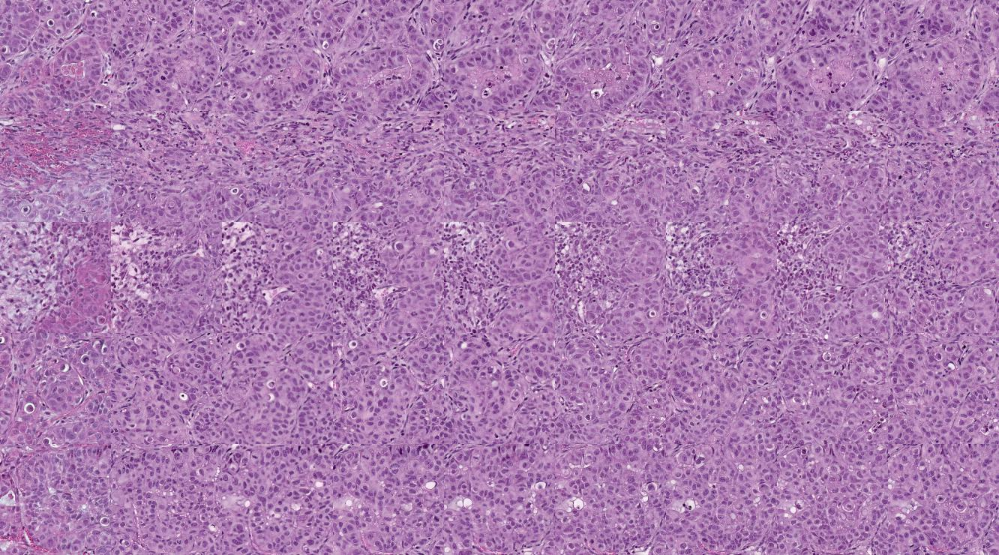
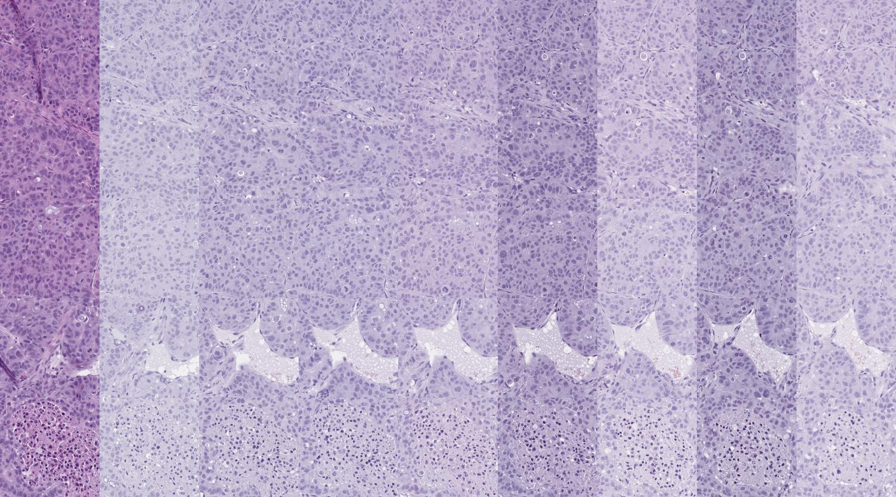
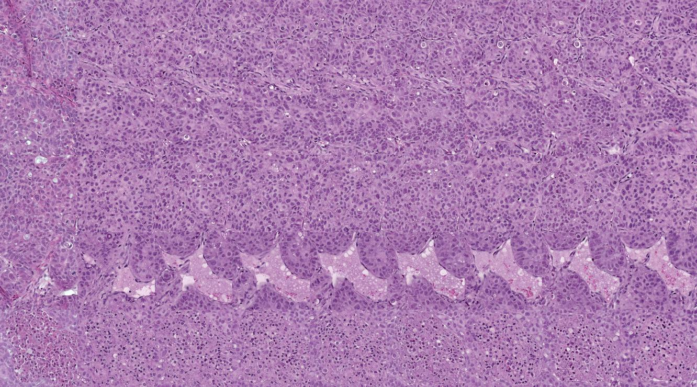

*On the longer term, we plan to merge the functionality from this repository into the [`salad`](https://github.com/domainadaptation/salad) domain adaptation toolbox. Please approach me (see [contact below](#contact)) if you are interested in contributing related algorithms for stain normalization.*

[](https://github.com/stes/fan/blob/master/LICENSE)

# Normalization of Histological Stains using Deep Convolutional Features

In this repository we will provide the code for the paper *Normalization of Histological Stains using Deep Convolutional Features*.
For more information, visit [the project homepage](https://stes.github.io/fan).

The preprint is available at [arxiv.org/abs/1708.04099](https://arxiv.org/abs/1708.04099), the final paper is available in [Lecture Notes in Computer Science book series](https://link.springer.com/chapter/10.1007/978-3-319-67558-9_16).

A PyTorch implementation featuring several improvements compared to the original architecture is available at [github.com/stes/fan-pytorch](https://github.com/stes/fan-pytorch).

## Installation

For the list of dependencies, have a look at the ``requirements.txt`` file.
The exact package versions are most critical for `Lasagne` and `Theano`.
For all other Python packages, a more recent version is also likely to function.


### Training a model

In order to deploy the model, take the following steps

- extract your image dataset to the data/ folder

```
THEANO_FLAGS="device=gpu0" python solver.py -m 13 -H 1 -E 1 -T 2 --comment "model_name"
```

For application of the code, we provide two scrips, ``solver.py`` and ``normalize.py``.
While the former is used to train the model we propose in the paper, the latter is used to apply a trained model.

Using the proposed feature aware normalization network from our paper is simple

``` python
from stainnorm.models import fan

model = FAN()
model.fit(X)
X_normalized = model.transform(X)
```

### Using pre-trained models

We provide a pre-trained network fitted to the `HET+` stain, providing relatively strong color output.
Note that if the tissue distribution of your own data is signficiantly different from ours, the network should be re-trained with a better noise model, as the training objective assumes that all input data was covered by the noise distribution.

For application of a pre-trained network, run

``` python
model = fan.NormalizationNetwork(fname='weights/171028-weights-dlmia.npz',
                                patch_size=300,
                                batch_size=10)
X_normalized = model.transform(X)
```

Also have a look at the [Demo Notebook](https://github.com/stes/fan/blob/master/Demo.ipynb) in this repository.
Please note that since we avoided padding operations in the whole network, the output images will be smaller than the input images. This design choice is due to the fact that whole slide images are in general gigapixel images with sufficient border regions around the main regions of interest.


### Dataset

The validation dataset is available in this repository under [Releases](https://github.com/stes/fan/releases).


### Further Notes

Please consider that in this repository, we also published several additional
functions you might consider useful for further research.
Especially, consiser the additional functions in ``layers.py``

We also provide you with a range of additional models and routines for cross-validating
several setups.

## Reference

If you use our dataset, the Feature Aware Normalization module or other parts of the code
provided here in your own work, please cite [our paper](https://arxiv.org/abs/1708.04099):

```
@incollection{bug2017context,
  title={Context-based Normalization of Histological Stains
         using Deep Convolutional Features},
  author={Bug, Daniel and Schneider, Steffen
      and Grote, Anne and Oswald, Eva
      and Feuerhake, Friedrich and Sch{\"u}ler, Julia
      and Merhof, Dorit},
  booktitle={Deep Learning in Medical Image Analysis
             and Multimodal Learning for Clinical Decision Support},
  pages={135--142},
  year={2017},
  publisher={Springer}
}
```

We also have a pre-print available on arxiv: [abs/1708.04099](https://arxiv.org/abs/1708.04099).

## Normalization Examples

Below you find images from the validation set. Each image consists of nine different staining protocols and five different regions from each slide are shown.
In total, the validation set used consists of 5 slides with 5 images extracted from each slide and nine protocol variants available.

Normalization results to the ``HoEoTp`` protocol (first column) are shown.

Before (Block A):

Normalized:


Before (Block B):

Normalized:


Before (Block C):

Normalized:


Before (Block D):

Normalized:


Before (Block E):

Normalized:


For an interactive overview, please visit the [project homepage](https://stes.github.io/fan).

## Contact

For any inquiries about the dataset or our work, please contact [Daniel Bug](http://www.lfb.rwth-aachen.de/institute/team/bug) or [Steffen Schneider](http://stes.io).
